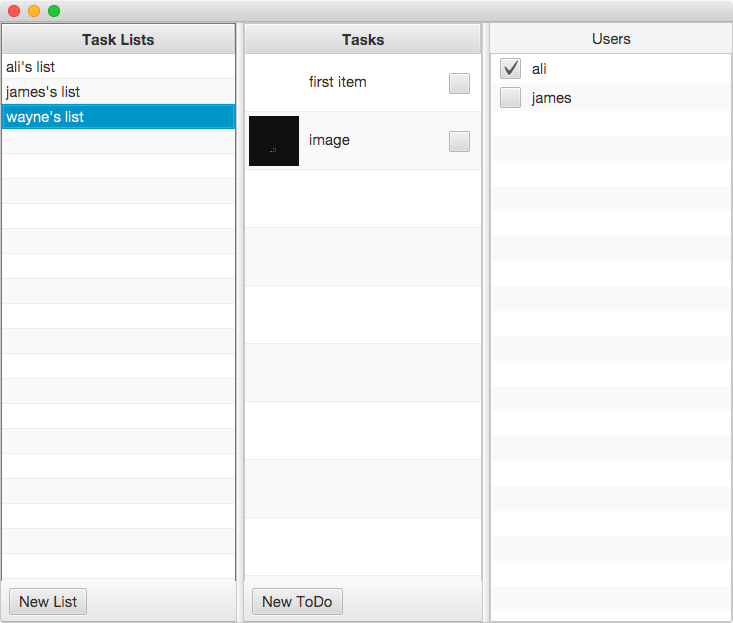

# TodoLite JavaFX

## Getting Started

Run the following from Terminal:

```bash
git clone git@github.com:CouchbaseTutorials/todolite-javafx.git
cd todolite-javafx
```

Open this folder in IntelliJ and click the **Run** button in the upper right corner. A new window should open (of course your's won't have any data in it :D):



Go ahead and create a new List and Task. At the time of this writing, the JavaFX version of TodoLite doesn't implement all of the features. Right now, you're logged in as the user with name wayne and the password is pass. So if you run the TodoLite Android version, you can login with those credentials or create a new user on the Sign Up page and share Lists with other Users. Both applications would be syncing to a Sync Gateway instance running at [http://9cec7a6e-jamiltz.node.tutum.io:4984](http://9cec7a6e-jamiltz.node.tutum.io:4984).