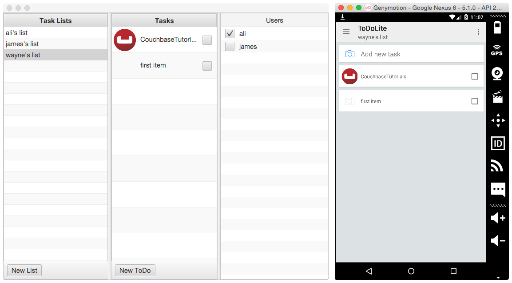
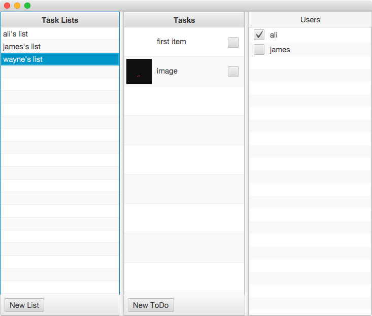
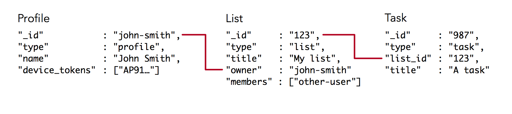
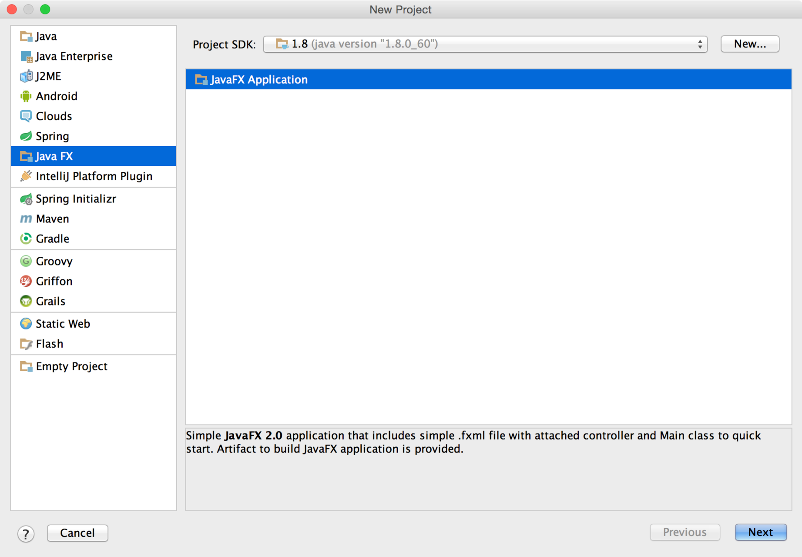
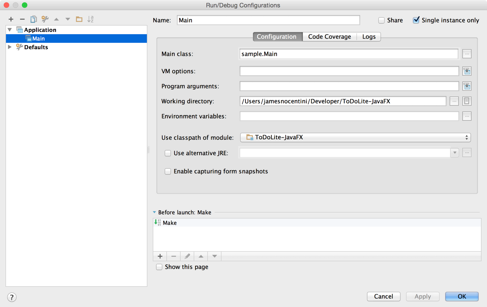
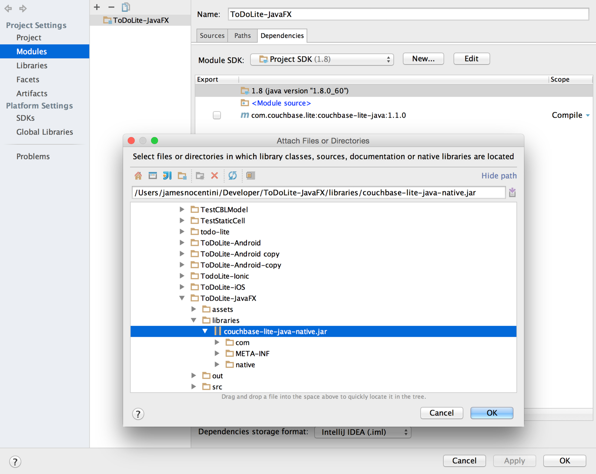
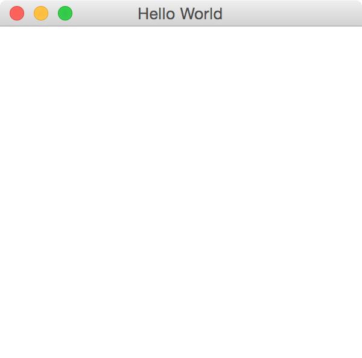

# Getting Started with JavaFX and Couchbase Mobile

JavaFX and Couchbase Mobile is a great combo for creating desktop class applications with rich user interfaces and fast data access. In this tutorial, you will learn the following core concepts:

- Learn about replication, security and deployment using the TodoLite sample
- How to start a new JavaFX project with Couchbase Mobile as a dependency

We won't cover TodoLite for Android in this post but you could have both applications running side by side and replicating documents and attachments via Sync Gateway:



## TodoLite JavaFX

To speed things up, you will clone some source code with the following:

```bash
git clone git@github.com:CouchbaseTutorials/todolite-javafx.git
cd todolite-javafx
```

Open this folder in IntelliJ and click the **Run** button in the upper right corner. A new window should display open (of your course your's won't have any data in it :D):



Go ahead a create a new List and Task. At the time of this writing, JavaFX doesn't implement all of the features. Right now, you're logged in as the user with name wayne and the password is pass. So if you run the TodoLite Android, you can login with as this particular user or create a new user share other List with other Users. Both instance would be syncing to a Sync Gateway instance running at [http://9cec7a6e-jamiltz.node.tutum.io:4984](http://9cec7a6e-jamiltz.node.tutum.io:4984).

## The Data Model

TodoLite has the following data model. Notice how documents are kept small in size and the references (you could think of them as foreign keys) between the documents:



## Deployment

The back-end for TodoLite is composed of Sync Gateway and an App Server to allow users to Sign Up. At the time of this writing, the Login and Sign Up screens have not been implemented for the JavaFX version of TodoLite. You can follow the README in the [todolite-development](https://github.com/CouchbaseTutorials/todolite-development) repostory to get both servers running locally.

## How-To

### Creating a new JavaFX + Couchbase Mobile application

Open IntelliJ IDEA and choose the **Create New Project** menu. On the left pane, select the **JavaFX** application template and set the Project SDK to 1.8.



Name the application as you wish and click **Finish**, this will open your newly created project in a new window. Before we begin writing code, there are a couple configuration settings to change. Select the **Edit Configurations...** menu in the top right corner which will open a new window. Check the **Single instance only** box to ensure that the IDE doesn't start a new instance of the application every time you click the Run button.



With that, let's turn our attention to adding Couchbase Lite as a dependency to the project.


Select **File\Project Structure...** from the top menu bar, a new window will open and on the **Modules** tab, add a new Library from Maven:


A search field will appear in a popup window, type **com.couchbase.lite:couchbase-lite-java:1.1.0** and click **OK**. This will download the library and add it to the project. Next, you will add a JAR file that contains the native library for the platform you're running the application on (Windows, Mac...). For OS X users, download this JAR file and add it in a new directory called **libraries** in your project. Return the **Modules** window and add this JAR file from the **Add > JARs or directories...** menu:



Click **OK** and run the application. You should see a blank window with the message **Hello World** in the status bar:



### Open a new Database and save a Document 

In your new project, open **Main.java** and create a new method called `startCouchbase` with the following:

```java
private void startCouchbase() {
    JavaContext context = new JavaContext();
    Manager manager = null;
    try {
        manager = new Manager(context, Manager.DEFAULT_OPTIONS);
    } catch (IOException e) {
        e.printStackTrace();
    }
    Database database = null;
    try {
        database = manager.getDatabase("myapp");
    } catch (CouchbaseLiteException e) {
        e.printStackTrace();
    }
    Map<String, Object> properties = new HashMap<String, Object>();
    properties.put("session", "Couchbase Mobile");
    properties.put("conference", "JavaOne");
    Document document = database.createDocument();
    try {
        document.putProperties(properties);
    } catch (CouchbaseLiteException e) {
        e.printStackTrace();
    }
}
```

Here, you're opening a new database called myapp and persisting a new document with a session and conference field. You can read more about the different APIs in the [documentation guides](http://developer.couchbase.com/documentation/mobile/1.1.0/develop/guides/couchbase-lite/index.html) or refer to the [TodoLite-JavaFX](https://github.com/CouchbaseTutorials/todolite-javafx) sample app.

Call the `startCouchbase` method in the `start` method of **Main.java**

## Sync Gateway

The quickiest way to get started with replication is to download the latest version of Sync Gateway:

> http://www.couchbase.com/nosql-databases/downloads#Couchbase\_Mobile

And use one of the provided configuration template as the command line argument for starting Sync Gateway:

```bash
$ ~/Downloads/couchbase-sync-gateway/bin/sync_gateway basic-walrus-bucket.json 
```

The specified configuration file has the following:

```js
{
  "log": ["*"],
  "databases": {
    "db": {
      "server": "walrus:",
      "users": { "GUEST": { "disabled": false, "admin_channels": ["*"] } }
    }
  }
}
```

Here, you're creating a database called **db** and enable the **GUEST** which means that unauthenticated requests should be allowed and processed.

That's it! You now have a Sync Gateway database running on your machine that can be reached at [http://localhost:4984/db/](http://localhost:4984/db/).

## Adding Sync

Head back to the JavaFX application and add a new `startReplications` method:

```java
public void startReplications() {

    URL remoteURL = null;
    try {
        remoteURL = new URL(remoteDatabase);
    } catch (MalformedURLException e) {
        e.printStackTrace();
    }

    Replication pull = database.createPullReplication(remoteURL);
    Replication push = database.createPushReplication(remoteURL);

    pull.setContinuous(true);
    push.setContinuous(true);

    pull.start();
    push.start();

}
```

Call the `startReplications` below the `startCouchbase` method and restart the application. You should now see the document you created previously in the Sync Gateway Admin UI.

## Where To Go From Here

Congratulations! You've built your first JavaFX + Couchbase Mobile application with replication. You're now ready to learn the following concepts:

- The [Sync Function](http://developer.couchbase.com/documentation/mobile/1.1.0/develop/guides/sync-gateway/sync-function-api-guide/index.html) to define access rules
- [Couchbase Lite Views](http://developer.couchbase.com/documentation/mobile/1.1.0/develop/guides/couchbase-lite/native-api/view/index.html) to write custom queries

Feel free to share your feedback, findings or ask any questions in the comments below or in the forums. Talk to you soon!